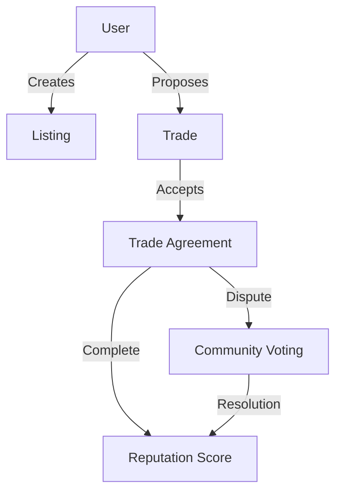

# TradeNest - Decentralized Local Barter Exchange

A decentralized platform enabling direct peer-to-peer exchange of goods and services within local communities, powered by Clarity smart contracts on the Stacks blockchain.

## Overview

TradeNest facilitates trust-based bartering by allowing users to:
- List goods and services they want to trade
- Find potential trade partners in their local area
- Create and manage trade agreements
- Build reputation through successful exchanges
- Participate in community-driven dispute resolution

The platform eliminates the need for traditional currency, instead focusing on direct exchange of value between community members while maintaining trust through a reputation system.

## Architecture



The system consists of several interconnected components:
- **Listings**: User-created offers for goods or services
- **Trades**: Agreements between two parties
- **Reputation System**: Tracks user reliability and trade history
- **Dispute Resolution**: Community-driven conflict resolution mechanism

## Contract Documentation

### trade-nest.clar

The main contract managing the entire barter exchange platform.

#### Key Features:
- Listing management
- Trade agreement lifecycle
- Reputation tracking
- Geographic-based matching
- Dispute resolution system

#### Access Control:
- Listing modifications restricted to owners
- Trade actions limited to involved parties
- Dispute voting requires minimum reputation score
- Community voting restricted to non-participants

## Getting Started

### Prerequisites
- [Clarinet](https://github.com/hirosystems/clarinet)
- [Stacks Wallet](https://www.hiro.so/wallet)

### Installation

```bash
# Clone the repository
git clone [repository-url]

# Install dependencies
clarinet requirements

# Test the contracts
clarinet test
```

## Function Reference

### Listing Management

```clarity
(create-listing 
  (title (string-ascii 100))
  (description (string-ascii 500))
  (category (string-ascii 50))
  (offering (string-ascii 200))
  (wanting (string-ascii 200))
  (latitude int)
  (longitude int)
)

(update-listing
  (listing-id uint)
  (title (string-ascii 100))
  (description (string-ascii 500))
  (category (string-ascii 50))
  (offering (string-ascii 200))
  (wanting (string-ascii 200))
  (latitude int)
  (longitude int)
  (active bool)
)
```

### Trade Management

```clarity
(propose-trade (listing-id uint))
(accept-trade (trade-id uint))
(mark-completed (trade-id uint))
(cancel-trade (trade-id uint))
```

### Dispute Resolution

```clarity
(file-dispute (trade-id uint) (reason (string-ascii 500)))
(vote-on-dispute (trade-id uint) (vote-for principal))
```

### Read-Only Functions

```clarity
(get-user-reputation (user principal))
(get-listing (listing-id uint))
(get-trade (trade-id uint))
```

## Development

### Testing

Run the test suite:
```bash
clarinet test
```

### Local Development

1. Start Clarinet console:
```bash
clarinet console
```

2. Deploy contracts:
```bash
(contract-call? .trade-nest ...)
```

## Security Considerations

### Limitations
- Geographic coordinates are stored on-chain (privacy consideration)
- Dispute resolution requires active community participation
- Minimum reputation threshold for voting (5 points)

### Best Practices
- Always verify trade partner reputation before accepting trades
- Document trade agreements thoroughly
- Allow sufficient time for counterparty response
- Use dispute resolution as a last resort
- Maintain accurate geographic coordinates for local matching

### Risk Mitigations
- Trade status transitions are strictly controlled
- Self-trading is prevented
- Dispute voting has anti-manipulation measures
- Reputation scores can't go below zero
- Community voting requires minimum reputation